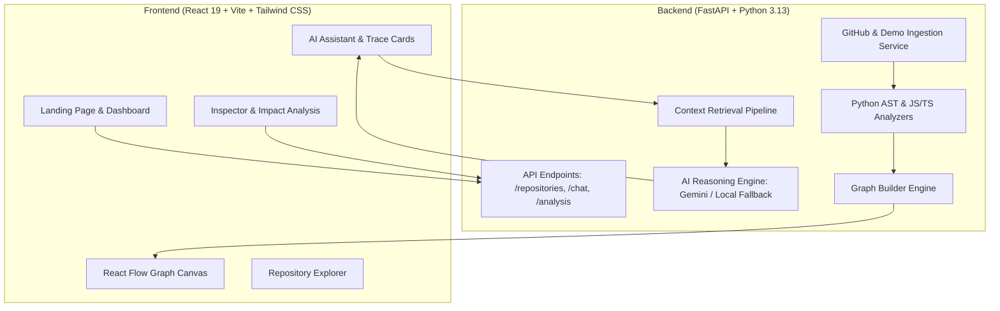
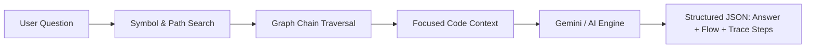

# CodePath AI

> **Understand any codebase. Visually.**

CodePath AI is an AI-powered visual codebase explorer that analyzes GitHub repositories, builds an interactive dependency graph, and uses AI to explain how features flow end-to-end through the codebase.

---

## Problem

Understanding an unfamiliar codebase is daunting and slow. Developers usually have to:
* Open dozens of files across multiple directories.
* Manually search for function definitions and follow chains of imports.
* Guess which API routes connect frontend views to backend services.
* Spend hours figuring out the blast radius before making a change.

## Solution

CodePath AI reduces this friction into a 5-step intuitive flow:

$$\text{Connect Repository} \longrightarrow \text{Analyze AST} \longrightarrow \text{Ask AI} \longrightarrow \text{Visualize Graph} \longrightarrow \text{Understand Flow}$$

---

## Features

* 🗺️ **Interactive Code Graph**: Hierarchical dependency visualization powered by React Flow and Dagre, color-coding components, API routes, services, data models, and database managers.
* 🤖 **Context-Aware AI Assistant**: Retrieves repository context, follows dependency relationships, and provides precise architectural explanations.
* ⚡ **Visual Feature Tracing ("Trace This Feature")**: Highlights end-to-end execution paths with glowing animated edges and numbered step badges:
  $$\text{Frontend UI} \longrightarrow \text{API Client} \longrightarrow \text{Route} \longrightarrow \text{Auth / Service} \longrightarrow \text{Database}$$
* 💥 **Blast Radius & Impact Analysis**: Simulates code modifications to calculate direct dependents, transitive callers, and risk rating (`LOW`, `MEDIUM`, `HIGH`).
* 📁 **Repository Explorer**: Collapsible tree navigation with file type badges and instant graph focusing.
* 🧪 **Zero-Setup Demo Mode**: Bundled full-stack demo application with realistic authentication and payment flows that runs instantly without external API rate limits.
* 🛡️ **Code Treated As Data**: Analyzes Python AST and JS/TS code as text data without executing arbitrary untrusted scripts.

---

## Architecture



### Context Retrieval Pipeline



---

## Tech Stack

| Tier | Technologies |
|---|---|
| **Frontend** | React 19, Vite, Tailwind CSS 4, `@xyflow/react`, `dagre`, `lucide-react` |
| **Backend** | Python 3.13, FastAPI, Pydantic 2, Uvicorn, Httpx, Pytest |
| **Code Analysis** | Python `ast`, JavaScript/TypeScript Regex & AST extractor, Custom Graph Builder |
| **AI Provider** | Google Gemini (`gemini-1.5-flash`), with deterministic semantic fallback engine |
| **Deployment** | Vercel (Frontend), Render / Railway (Backend) |

---

## How It Works

1. **Ingestion**: When a GitHub repository URL or the bundled demo is selected, CodePath AI downloads source files, ignoring binary files, virtual environments, `.git`, and `node_modules`.
2. **AST Analysis**:
   * **Python**: Uses `ast.parse` to extract `Import`, `ImportFrom`, `FunctionDef`, `ClassDef`, `Call` nodes, decorators, and docstrings.
   * **JavaScript/TypeScript**: Parses ESM imports, CommonJS `require`, exported components, functions, and client `fetch` / `axios` endpoints.
3. **Graph Resolution**: `GraphBuilder` maps relative and module imports to concrete node IDs and bridges client network calls to server route endpoints.
4. **AI Reasoning**: When asked a feature question (e.g., *"How does authentication work?"*), the retrieval pipeline finds candidate nodes, walks outbound and inbound edges to discover the full execution chain, and produces structured trace steps.
5. **Interactive Visualization**: React Flow renders the layout with Dagre positioning and highlights traced nodes and animated edges on demand.

---

## Installation

### Prerequisites
* Python 3.10+
* Node.js 18+ and npm

### 1. Clone & Setup Backend

```bash
cd backend
python -m venv venv
# Windows:
.\venv\Scripts\activate
# Linux/macOS:
source venv/bin/activate

pip install -r requirements.txt
```

### 2. Setup Frontend

```bash
cd ../frontend
npm install
```

---

## Environment Variables

Copy `.env.example` in `backend/`:

```bash
cp backend/.env.example backend/.env
```

```env
PORT=8000
HOST=0.0.0.0

# Optional: Add your Gemini API Key (a deterministic local reasoning engine is included if omitted)
GEMINI_API_KEY=
AI_MODEL=gemini-1.5-flash

# Optional: Increases GitHub API limit from 60 req/hr to 5,000 req/hr
GITHUB_TOKEN=
```

---

## Running Locally

### Option A: Run Backend Server
```bash
cd backend
python -m uvicorn app.main:app --host 127.0.0.1 --port 8000 --reload
```
API Documentation will be available at: [http://127.0.0.1:8000/docs](http://127.0.0.1:8000/docs)

### Option B: Run Frontend Dev Server
```bash
cd frontend
npm run dev
```
Open [http://127.0.0.1:5173](http://127.0.0.1:5173) in your browser.

---

## Demo Walkthrough

1. **Open the App**: Visit [http://127.0.0.1:5173](http://127.0.0.1:5173).
2. **Launch Demo**: Click **Try Demo** on the landing page or navbar.
3. **Explore the Graph**: See the interactive 13-node, 18-edge dependency graph spanning `frontend` and `backend`. Use zoom, pan, and category filters.
4. **Ask a Feature Question**: In the AI Assistant tab, click the suggested prompt:
   > *"How does authentication work?"*
5. **Trace the Feature**: Click **Trace This Feature** in the AI chat response.
   * Watch the graph pulse and highlight the exact sequence:
     $$\text{Login.jsx} \longrightarrow \text{apiClient.js} \longrightarrow \text{auth\_routes.py} \longrightarrow \text{auth\_service.py} \longrightarrow \text{user.py} \longrightarrow \text{db.py}$$
6. **Inspect File Details**: Click `backend/services/auth_service.py` to view its role, functions, classes, imports, and code preview.
7. **Analyze Impact**: Click **Analyze Impact & Blast Radius** to see that modifying `auth_service.py` presents a **HIGH** risk affecting 7 downstream files and 3 API endpoints.

---

## Running Tests

Run the full automated test suite:

```bash
cd backend
python -m pytest tests/ -v
```

All 9 unit and integration tests pass:
* `test_python_analyzer`: AST classes, functions, and import parsing
* `test_javascript_analyzer`: React component, functions, and export detection
* `test_parse_github_url`: URL sanitization and regex validation
* `test_demo_repo_analysis`: End-to-end demo codebase ingestion
* `test_graph_builder_resolves_imports`: Cross-tier edge construction
* `test_health_check`: Server health endpoint
* `test_demo_repository_endpoint`: Graph serialization schema
* `test_chat_query_endpoint`: AI codebase Q&A and trace step generation
* `test_impact_analysis_endpoint`: Blast radius calculations

---

## Future Roadmap

- [ ] Support for Go, Rust, and Java language parsers
- [ ] Git commit diff overlay to highlight changed nodes in open Pull Requests
- [ ] Vector database indexing for ultra-large multi-repository monorepos
- [ ] Exportable architectural diagrams in Mermaid and SVG format
